# **PPA Improvements of riscv32i and ibex using OpenROAD Flow Scripts** #  
&nbsp;

## **Table of Contents** ##
* [1. Introduction](https://github.com/sani42073/OpenROAD-flow-scripts/tree/7nmcontest#1-introduction)
* [2. Tool Flow](https://github.com/sani42073/OpenROAD-flow-scripts/tree/7nmcontest#2-tool-flow)
* [3. Challenges](https://github.com/sani42073/OpenROAD-flow-scripts/tree/7nmcontest#3-challenges)
* [4. Observation](https://github.com/sani42073/OpenROAD-flow-scripts/tree/7nmcontest#4-observation)
* [5. What is Do-able?](https://github.com/sani42073/OpenROAD-flow-scripts/tree/7nmcontest#5-what-is-do-able)
  * [5.1 Synthesis](https://github.com/sani42073/OpenROAD-flow-scripts/tree/7nmcontest#51-synthesis)
  * [5.2 Floorplan](https://github.com/sani42073/OpenROAD-flow-scripts/tree/7nmcontest#52-floorplan)
  * [5.3 CTS](https://github.com/sani42073/OpenROAD-flow-scripts/tree/7nmcontest#53-cts)
  * [5.4 Route](https://github.com/sani42073/OpenROAD-flow-scripts/tree/7nmcontest#54-route)
* [6. Work Done](https://github.com/sani42073/OpenROAD-flow-scripts/tree/7nmcontest#6-work-done)
  * [6.1 Synthesis](https://github.com/sani42073/OpenROAD-flow-scripts/tree/7nmcontest#61-synthesis)
  * [6.2 Floorplan](https://github.com/sani42073/OpenROAD-flow-scripts/tree/7nmcontest#62-floor-plan)
  * [6.3 CTS](https://github.com/sani42073/OpenROAD-flow-scripts/tree/7nmcontest#63-cts)
  * [6.4 Route](https://github.com/sani42073/OpenROAD-flow-scripts/tree/7nmcontest#64-route)
* [7. Conclusion](https://github.com/sani42073/OpenROAD-flow-scripts/tree/7nmcontest#7-conclusion)
* [8. Author](https://github.com/sani42073/OpenROAD-flow-scripts/tree/7nmcontest#8-author)
* [9. Acknowledgment](https://github.com/sani42073/OpenROAD-flow-scripts/tree/7nmcontest#9-acknowledgment)
* [10. Contact Information](https://github.com/sani42073/OpenROAD-flow-scripts/tree/7nmcontest#10-contact-information)

## **1. Introduction** ##
This repository contains all source code of OpenRoad scripts along with the modified scripts to get better PPA.   

Using the ORFS flow we are able to run the flow RTL to GDS within a very short time. After exploring different stages we are able to find some modifications which can improve the overall PPA. Here, we described some changes in parameters and scripts which can improve the performance of the riscv32i and ibex design while keeping the design DRC free.

## **2. Tool Flow** ##
This flow chat represent the RTL to GDS flow using OpenRoad flow script.

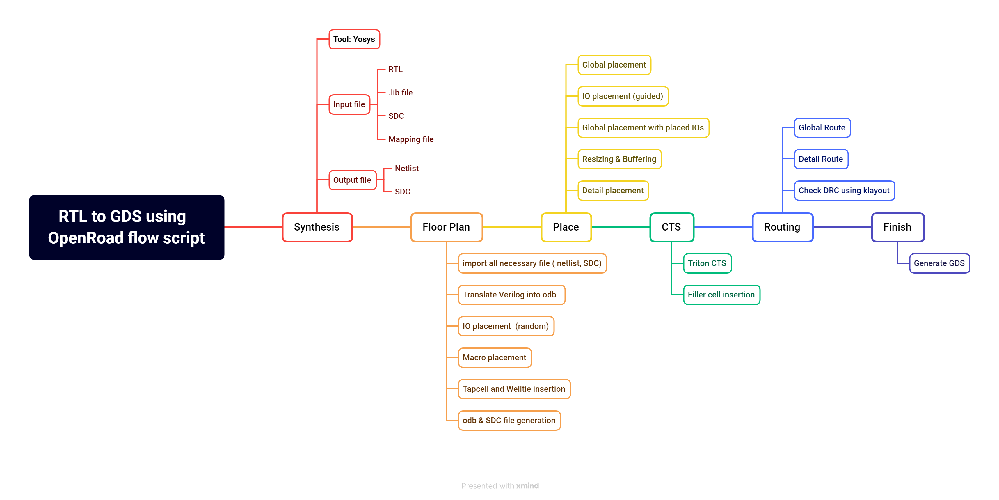

## **3. Challenges** ##

* Using different VT cell on synthesis.
* Placing the macro in proper position to maintain better PPA.
* Finding proper pin placement.
* Maintain proper cluster size and diameter to gain best clock skew.
* Finding the appropriate buffer or clock inverter cell for better timing.
* High routing congestion while increasing clock frequency.
* Distributing the metal layers properly for Clock tree, signal net and pin to get better PPA without zero negative slack.
* Adjust the global routing layer properly to minimize routing congestion.
* Keep the design DRC free while increasing the clock frequency.
* Maintaining or keeping the DRV at minimum.

## **4. Observation** ##

* In synthesis, yosys tool can’t handle multiple type  of library file. So, we can’t able to use different type of VT cell in the design. We can only use the RVT or LVT or SLVT cell.
* In the library file there wasn’t any clock buffer cell so we had to use the normal buffer cell and clock inverter for CTS.
* While we change the macro position in our design for some macro placement tool wasn’t able to route properly due to high routing congestion.
* While increasing the clock frequency we show some DRC violation (for example minimum spacing violation) in our routing stage.

## **5. What is Do-able?** ##

### **5.1 Synthesis** ###

* Using SLVT or LVT or RVT cell
* Using different optimization switch and attribute.

### **5.2 Floorplan** ###

* Changing the macro placement.
* Changing the pin placement and Pin metal layer.

### **5.3 CTS** ###

* Changing cluster size and diameter.
* Changing CTS cell.
* Defining clock routing layer.
* Adding setup and hold slack margin

### **5.4 Route** ###

* Adjust the global routing layer .
* Changing metal routing layer.

## **6. Work Done** ##

### **6.1 Synthesis:** ###
we changed the PDK config file and used the SLVT cell for our design to improve the performance. Because SLVT has a lower delay than other VT cell.

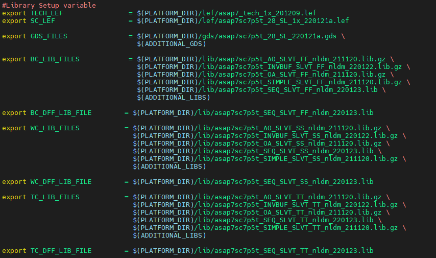    
&nbsp;
#### **Design Specific Changes on synthesis stage:** ####
We used SLVT cell for both riscV32i and ibex design.

### **6.2 Floor Plan:** ###

* While increasing frequency we faced some Metal spacing related DRC violation and changing the pin metal layer solve the issue. Also by changing the pin metal layer we can maintain the routing congestion.

##### **For riscV32i:** #####
For riscV32i design we used M4 and M7 metal layer for horizontal and vertical Pin layer. 

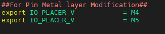

##### **For ibex:** #####
For ibex design we used M4 and M5 metal layer for horizontal and vertical Pin layer.  
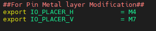

### **6.3 CTS:** ###

* We changed clock routing layer for our design to ensure proper use or routing layer.

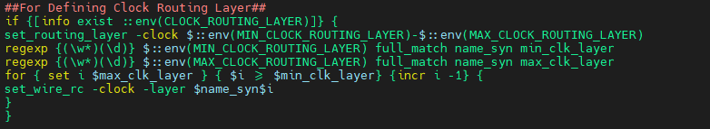

* We Also added Remove_buffer and reapair_design command to remove all buffer tree and rebuilt the clock tree again to get better clock skew.

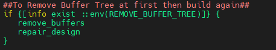

* We also changed cluster size and diameter to improve the clock skew.

* We added CTS  cell list for our design to improve the clock skew. 

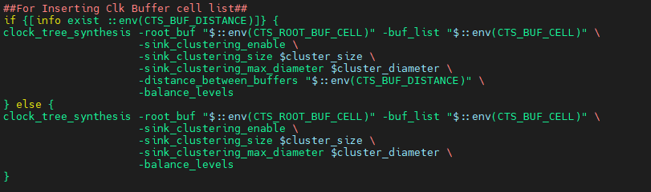

&nbsp;
#### **Design Specific Changes on CTS stage:** ####
##### **For riscV32i:** #####
The changes on design config.mk is given below:

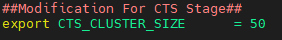

##### **For ibex:** #####
The changes on design config.mk is given below:

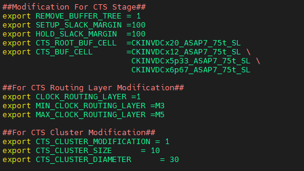

### **6.4 Route:** ###
* We modified the global layer adjustment attribute in our design to maintain proper routing congestion and proper uses of routing resources and which lead to better PPA. 

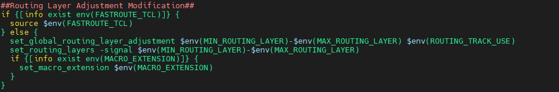

* We also modified the signal routing layer to maintain lower routing congestion and keep the routing DRC free and get better PPA. 

&nbsp;
#### **Design Specific Changes on Route stage:** ####
##### **For riscV32i:** #####
The changes on design config.mk is given below:

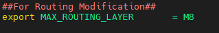

##### **For ibex:** #####
The changes on design config.mk is given below:

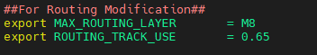

## **7. Conclusion** ##
By multiple test runs using various resources available, we
were able to come up with ideas that were able to meet the
design goals of the contest which was to achieve best performance (Best fmax) without any timing violation (0 wns).**For riscV32i design we are able to achieve 771.01 MHz frequency and for ibex we are able to achieve 769.23 MHz frequency with 0 wns, we could have achieved more better frequency but in that case DRV (Design Rule Violations) violation will be much larger and that's why we didn't increase the frequency after 771.01 MHz**. Here is the comparison of the base run using the default flow script of OpenRoad (on 625MHZ for riscV32i and 568.18 MHz for ibex) and the base run using all our modifications (on 769.63 MHz for both riscV32i and ibex).

&nbsp;

##### **Comparison for riscV32i design:** #####  

|Criteria| Default flow script | Modified flow script |
|---------|---------------------| ---------------------|
|Frequency| 625MHZ | 777 MHz |
|Setup ws | 12.015 ps | 40.28 ps |
|setup tns| 0 | 0 |
|Hold ws | 25.27 ps | 24.30 ps |
|Hold tns| 0 | 0 |
|DRC after routing| 0 | 0 |

&nbsp;

##### **Comparison for ibex design:** #####  

|Criteria| Default flow script | Modified flow script |
|---------|---------------------| ---------------------|
|Frequency| 568.18 MHz | 769.23 MHz |
|Setup ws | -106.495 ps | 15.17 ps|
|setup tns| 0 | 0 |
|Hold ws | 35.45 ps | 18.67 ps |
|Hold tns| 0 | 0 |
|DRC after routing| 0 | 0 |

*Note:* 
* After cloning the repository, We need to source the setup.env.sh file.
* And, after that we need to Uncomment the design in Makefile and run "make finish" command to run the flow.

## **8. Author** ##
Sajjad Hossain Sani  
Physical Design Department  
Neural Semiconductor Limited  
Dhaka, Bangladesh

## **9. Acknowledgment** ##
* Neural Semiconductor Limited
* Neural Semiconductor Physical Design Team

## **10. Contact Information** ##
* Sajjad Hossain Sani, Physical Design Engineer, sajjad.hossain@neural-semiconductor.com
* Neural Semiconductor Limited , Dhaka, Bangladesh ,http://www.neural-semiconductor.com/

